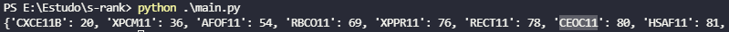

S-RANK
=============

> :warning: python 3

Script em Python para ajudar na metodologia [s-rank](https://clubedovalor.com.br/blog/melhores-fiis-s-rank/). 
A base de dados utilizada foram os fundos no [fundsexplorer](https://www.fundsexplorer.com.br/ranking).

O script vai analizar o DY, P/VPA e a liquidez. 

O resultado será algo parecido com a imagem a baixo, um dicionário de {'nome do fundo': nota}

# Tecnologias usadas no projeto.

- json
- [requests](https://pypi.org/project/requests/)
- [BeautifulSoup](https://pypi.org/project/beautifulsoup4/)